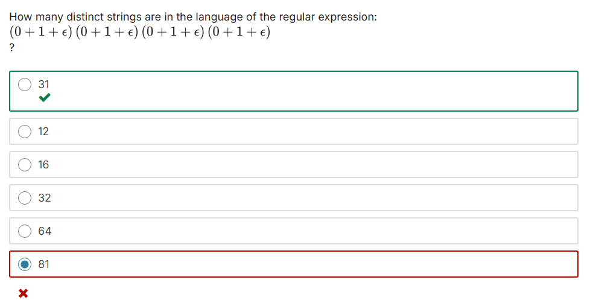

# Week 02: Lexical Analysis & Finite Automata
In the second week of the course, I've learnt what is a Lexical Analyzer, what it does and about automatas, deterministic and non-deterministic ones and how use them to describe the states of a program.

# Notes on classes
I'm writing this a few weeks after I've watched the classes. I'm planning to rewatch this week lectures and, if I do that, I write the notes here. Else, this will all the notes about that. It is what it is.

# Notes on Quiz #1
At the end of each learning week, we have a quiz to challenge us and see what we've truly learned.

In this weekly quiz, I scored 1/12. That's harsh.

After getting this grade right in the first quiz, I decided to pause the course a little and understand what I didn't get from the classes. 

Why the alternatives I choose were wrong? Why the correct answer is that (as show in the end of the quiz)? What was the logic expected for me to answer the questions? What I did get wronng? As I sought the answers to these questions,

So I sought the answer of these questions, being the curious mind I'm. Here's what I've found (spoiler alert).

## Question 01


### What I got wrong
I misread the statement, and tried to calculate all the possible strings the regular expression could produce. In order to do this, I've calculated all the possibilities of the four regular expressions `(0 + 1 + ε)`. Since each regular expression have three possibilites: 0, 1 or empty string (ε) and we have four of them, my logic conclusion was to calculate `3^4`.

Well, I was wrong.

I didn't catch the word `distinct`, which makes all the difference here.

### Why that alternative is the correct answer?
#### Explanation
Even noticing that I should had calculated the distinct string possibilities, I didn't know how to do that.

This is what I've discovered:

Since the possibilities for each regular expression were 0, 1 or nothing (empty string), the result would be a binary string. And as each expression contains the **ε** character, it means that character could exist or not. Thus creating a scenario where this binary string could have any from 0 to 4 characters.

I'll detail this character by character, as I've understood.

1. We can have 0 characters.
This occurrs when all the regular expressions result in:
```
    (ε) (ε) (ε) (ε)
```
So, this scenario give us only `1` possible outcome: An empty string.

2. We can have 1 character.
In this scenario, the last three characters result in an empty string, but the first one doesn't, resulting in the following possibilities:
```
    0 (ε) (ε) (ε)
    1 (ε) (ε) (ε)
```

In this scenario, we have `2` possible outcomes.

3. We can have two characters.
As described before, incrementing a character on our binary string decreases the number of empty strings on the end of this string. Therefore, the resulting possibilities of a binary string with two charecters are:
```
    00
    01
    10
    11
```

This scenario give us `4` distinct possibilites.

4. We can have three characters.
Maybe you already get it where this is going, but I will proceed anyway, just because I find math fantastic.
```
    000
    001
    010
    011
    100
    101
    110
    111
```

In this scenario, there is `8` possibilities. 

5. We can have all four characters
```
    0000
    0001
    0010
    0011
    0100
    0101
    0110
    0111
    1000
    1001
    1010
    1011
    1100
    1101
    1110
    1111
```

In this scenario, we have `16` outcomes.

#### The answer
Having all this scenarios with different outcomes each, to get the answer to the question, weed need only to sum up the distinct outcomes possibilites.
1. gives us `1`.
2. gives us `2`.
3. gives us `4`.
4. gives us `8`.
5. gives us `16`.

All we need is to sum them up and, **abracadabra!**, we have `31`, the result expected.

If I got the logic before, that the outcome is a binary one, I could simply count sum up the bits of each character. Easier, faster and cleaner.

But well, I'm still learning and I found the discovery of this solution exciting.

