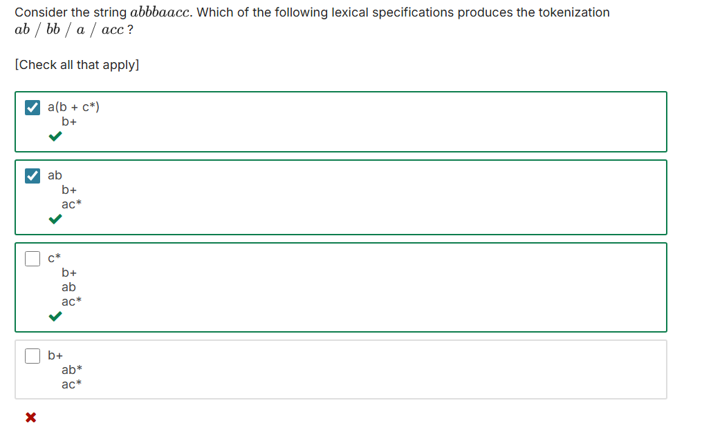

# Week 02: Lexical Analysis & Finite Automata
In the second week of the course, I've learnt what is a Lexical Analyzer, what it does and about automatas, deterministic and non-deterministic ones and how use them to describe the states of a program.

# Notes on classes
I'm writing this a few weeks after I've watched the classes. I'm planning to rewatch this week lectures and, if I do that, I write the notes here. Else, this will all the notes about that. It is what it is.

# Notes on Quiz #1
At the end of each learning week, we have a quiz to challenge us and see what we've truly learned.

In this weekly quiz, I scored 1/12. That's harsh.

After getting this grade right in the first quiz, I decided to pause the course a little and understand what I didn't get from the classes. 

Why the alternatives I choose were wrong? Why the correct answer is that (as show in the end of the quiz)? What was the logic expected for me to answer the questions? What I did get wronng? As I sought the answers to these questions,

So I sought the answer of these questions, being the curious mind I'm. Here's what I've found (spoiler alert).

## Question 01


### What I got wrong
I misread the statement, and tried to calculate all the possible strings the regular expression could produce. In order to do this, I've calculated all the possibilities of the four regular expressions `(0 + 1 + ε)`. Since each regular expression have three possibilites: 0, 1 or empty string (ε) and we have four of them, my logic conclusion was to calculate `3^4`.

Well, I was wrong.

I didn't catch the word `distinct`, which makes all the difference here.

### Why that alternative is the correct answer?
#### Explanation
Even noticing that I should had calculated the distinct string possibilities, I didn't know how to do that.

This is what I've discovered:

Since the possibilities for each regular expression were 0, 1 or nothing (empty string), the result would be a binary string. And as each expression contains the **ε** character, it means that character could exist or not. Thus creating a scenario where this binary string could have any from 0 to 4 characters.

I'll detail this character by character, as I've understood.

1. We can have 0 characters.
This occurrs when all the regular expressions result in:
```
    (ε) (ε) (ε) (ε)
```
So, this scenario give us only `1` possible outcome: An empty string.

2. We can have 1 character.
In this scenario, the last three characters result in an empty string, but the first one doesn't, resulting in the following possibilities:
```
    0 (ε) (ε) (ε)
    1 (ε) (ε) (ε)
```

In this scenario, we have `2` possible outcomes.

3. We can have two characters.
As described before, incrementing a character on our binary string decreases the number of empty strings on the end of this string. Therefore, the resulting possibilities of a binary string with two charecters are:
```
    0 0
    0 1
    1 0
    1 1
```

This scenario give us `4` distinct possibilites.

4. We can have three characters.
Maybe you already get it where this is going, but I will proceed anyway, just because I find math fantastic.
```
    0 0 0
    0 0 1
    0 1 0
    0 1 1
    1 0 0
    1 0 1
    1 1 0
    1 1 1
```

In this scenario, there is `8` possibilities. 

5. We can have all four characters
```
    0 0 0 0
    0 0 0 1
    0 0 1 0
    0 0 1 1
    0 1 0 0
    0 1 0 1
    0 1 1 0
    0 1 1 1
    1 0 0 0
    1 0 0 1
    1 0 1 0
    1 0 1 1
    1 1 0 0
    1 1 0 1
    1 1 1 0
    1 1 1 1
```

In this scenario, we have `16` outcomes.

#### The answer
Having all this scenarios with different outcomes each, to get the answer to the question, weed need only to sum up the distinct outcomes possibilites.
1. gives us `1`.
2. gives us `2`.
3. gives us `4`.
4. gives us `8`.
5. gives us `16`.

All we need is to sum them up and, **abracadabra!** We have `31`, the result expected.

If I got the logic before, that the outcome is a binary one, I could simply count sum up the bits of each character. Easier, faster and cleaner.

But well, I'm still learning and I found the discovery of this solution exciting.

## Question 02


Well, this was close! To be fair I thinked that I missed it all, but wow, I actually got at least one! Coming from a poor regex understandment background, this is such a success for me!

But well, there's more to ber understood right here, let's dive in.

### The problem
This tricky question have more to do with the **analysis order**, plus the **Longest Match** rule, than anything else.

Lets analyze the problem: the token *`abbbaacc`* should be tokenized into `ab`/`bb`/`a`/`acc`.

### Detailed Analysis
The first two specifications works. But why exactly? I remember writing in these specifications with pencil and paper, but now, 1 month later, I barely remember why I marked these options.

So, I will write down again, in a detailed walkthrough, how these specifications work.

---
1. 
```
    a(b + c*)
    b+
```
---
#### 1st iteration
the first rule, `a(b + c*)` read the string until it's two first characters: *`ab`bbaacc*.

This happens because this first rule is expecting an `a`, followed by a `b` **OR** followed by a `c`, which can appear any number of times, including not appearing at all (zero times).

So, the result of this iteration is the token `ab`.

---
#### 2nd iteration
The first rule looks for a string starting with `a`, but what we have left is *bbaacc*.

Since the first rule doesn't satisfy this condition, we look into the second rule: `b+`. This rule states something like "a `b` character that appears one or more times".

By this rule, we capture, again, the first two characters of the remaining string: *`bb`aacc*.

So, this is our result: `bb`.

---
#### 3rd iteration
This one is tricky. The first rule is `a(b + c*)` and, at a glimpse, it seem to have no matchs in the remaining string *aacc*.

But here's the catch: since `c*` states **zero** or more `c` characters, *`a`acc* is a complete valid token.

Then, this iteration token is simply `a`.

---
#### 4th iteration
Having the remaining string as *acc*, the first rule, `a(b + c*)`, serve us well here. I reads the first `a` and then reads the repeated `c` characters until the end of the string.

So, our final token will be `acc`.

### Result
The remaining tokes for each iteration were, in order: `ab`, `bb`, `a` and `acc`.

Since the tokenization asked is `ab`/`bb`/`a`/`acc`, this specification is right! ✅

---
2. 
```
    ab
    b+
    ac*
```
Here, we have the following rules:
- first: `ab`. This will capture any exactly combination of `a` followed by `b`.
- second: `b+`. Will capture an instace of one or more `b` characters repeated.
- third: `ac*`. Will capture an occurrance of `a` followed by `c` zero or more times.

---
#### 1st iteration
Reading the string *abbbaacc*, the first rule acts right in the beginning, getting us the token `ab`.

---
#### 2nd iteration
In the remaining string, *bbaacc*, the second rule acts: *`bb`aacc*.

---
#### 3rd iteration
Here, we have the same tricky situation. The first two rules can't get nothing from *aacc*. This string seems to not satisfy the third rule as well, in a first moment. 

But this is the exact same situation we've seen before and, as `c*` states **zero** or more characters, the third rule returns the token `a`.

---
#### 4th iteration
Here, the third rule acts again, tokenizing the remaining characters: `acc`.

### Result
We had obtained `ab`, `bb`, `a` and `acc`. The same the problem is asking. So yeah, this specification is valid as well! ✅

---
3. 
```
    c*
    b+
    ab
    ac*
```

4. 
```
    b+
    ab*
    ac*
```


